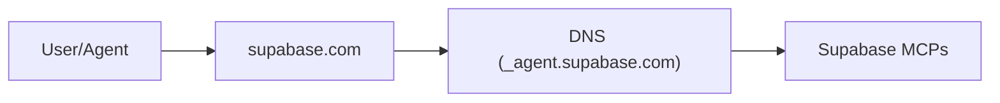

# Agent Interface Discovery (AID) 

> ##DNS for Agents
> *Type a domain – connect to its agent(s), instantly.*

Imagine opening your favourite AI‑powered IDE, typing just `supabase.com`, and having the client wire itself to the official Supabase MCP server with zero extra steps. No digging through docs, no JSON snippets, no token wrangling. That "it just works" moment is what **AID** delivers.

!!! agent "Agent-first Discovery"
    Agent wants to use a tool. It just enters `supabase.com` and automatically resolves the MCP endpoints—no documentation required.



## What it does (in one sentence)

AID is a protocol that uses DNS to discover agents. For simple cases, a single TXT record is all you need. For complex cases, that record can point to a rich `aid.json` manifest.

## Links

<div class="grid cards" markdown>

-   [:material-file-document-outline:{ .lg .middle } __Specification__](v1/specification.md)

    Read the full Specification

-   [:material-forum:{ .lg .middle } __Design Rationale__](rationale.md)

    Understand the design decisions for AID.

-   [:material-git:{ .lg .middle } __Versioning__](versioning.md)

    Learn how we version the AID specification.

-   [:material-cogs:{ .lg .middle } __Tools__](generator.md)

    Generate, resolve, and validate AID manifests.

</div>

## Why you should care

* **Good‑bye manual setup** – Paste a domain, not a 200‑line config.
* **Fewer docs, fewer errors** – The record is the source of truth, always up to date.
* **Works with today's winners** – Designed around the leading agent protocol (MCP) while staying agnostic for others (A2A, ACP, etc.).
* **Agents find tools, too** – Your agents can now locate and chain the services they need on the fly – true autonomy.
* **Zero lock‑in** – Uses plain DNS + HTTPS, so any provider can adopt it overnight.
* **Local/Diff domain tooling** - Enables complex protocol discovery via standardized mechanisms.

## How it works (30-second version)

1. **Simple Profile:** A client queries the `TXT _agent.<domain>` record. The record contains a `uri`, `proto`, and `auth` hint, allowing the client to connect immediately with no extra steps.
2. **Extended Profile:** If the TXT record also contains a `config` key, the client knows to fetch the full `aid.json` manifest from that URL. This unlocks the full power of the Extended Profile.
3. **Process Manifest:** The client parses the rich manifest, which can describe multiple ways to use the agent (**implementations**). It can list remote APIs, local packages (e.g., Docker, npx), detail complex authentication flows like OAuth 2.0, and specify required user configuration. The client chooses the best implementation it supports and follows the instructions to connect.

That is the whole boot‑strap layer. The heavy lifting (auth flows, task calls) stays in MCP or whichever protocol you choose.

---

### The full discovery flow

For those who like state charts, here's the exact handshake AID enables.

```mermaid
stateDiagram-v2
    [*] --> DNSLookup
    DNSLookup: Query TXT _agent.<domain>
    DNSLookup --> ParseTXT
    ParseTXT: Parse v=aid1; ...
    ParseTXT --> HasConfig{Has 'config' key?}
    HasConfig --> SimpleConnect: No
    SimpleConnect: Use uri/proto from TXT
    SimpleConnect --> Ready

    HasConfig --> FetchManifest: Yes
    FetchManifest: GET /.well-known/aid.json
    FetchManifest --> ProcessManifest
    ProcessManifest: Choose best implementation (local vs remote)
    ProcessManifest --> GatherCreds
    GatherCreds: Prompt for config/auth (e.g. OAuth, PAT)
    GatherCreds --> Ready

    Ready --> ProtocolHandshake: Connect via chosen protocol
    ProtocolHandshake --> MCPSession: MCP
    ProtocolHandshake --> A2ASession: A2A
    ProtocolHandshake --> ACPSession: ACP
    ProtocolHandshake --> OtherSession: Other...
    MCPSession --> [*]
    A2ASession --> [*]
    ACPSession --> [*]
    OtherSession --> [*]
```

---

### Want the deep dive?

* [**Rationale**](rationale.md) – *Why discovery belongs in DNS and how AID complements `.well-known`.*
* [**Specification**](v1/specification.md) – *Exact TXT keys, manifest schema, security model.*

(See the neighbouring docs in this folder.)
