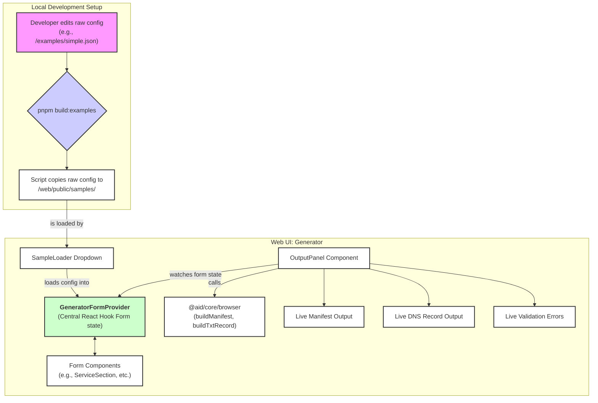

# AID Generator Web UI

A Next.js web application for generating and validating Agent Interface Discovery (AID) manifests in real-time. This tool provides an intuitive, responsive, form-based interface for creating AID configurations that comply with the official specification.

This web UI is part of a larger monorepo. For details on the core library and the AID specification itself, please see the [main project README.md](../../../README.md).

## 🎯 Key Features

-   **Live Generation & Validation**: Instantly see the generated `aid.json` manifest and DNS TXT record as you type. Get immediate, clear feedback on validation errors.
-   **Fully Responsive Design**: A two-column layout for desktop provides a comprehensive view, which seamlessly transitions to a mobile-friendly single-column layout.
-   **Centralized, Reactive State**: Built on a modern stack using React Hook Form and Context for robust and predictable state management.
-   **Browser-Native Core Logic**: Utilizes a browser-safe version of the `@aid/core` library, ensuring 100% spec compliance between the UI and the canonical implementation.
-   **Full Spec Support**: All authentication schemes and implementation types (remote, local) are supported.
-   **Sample Templates**: Load pre-built examples for common use cases like Auth0, Supabase, and multi-implementation profiles.

## 🏗️ Core Architecture: A Centralized & Reactive Form

The generator was refactored to address a core architectural challenge: the original implementation had a data model mismatch where the UI was attempting to load final, generated manifests as if they were pre-generation configuration files.

The new architecture is built around a **single source of truth for form state**, managed by `react-hook-form` and provided to all components via a React Context (`GeneratorFormProvider`). This eliminates prop-drilling and ensures all components are perfectly synchronized.

### Data Flow

This diagram illustrates how data moves from the raw example files to the reactive UI:



## 🔧 Core Components

### 1. `GeneratorFormProvider`
The heart of the application. It initializes `react-hook-form` and wraps the entire form, providing global state access to every component. This centralization is key to the app's stability and scalability.

### 2. `@aid/core/browser`
The engine for all generation logic. The UI exclusively imports from the `/browser` entry point of the core library. This is critical because it guarantees that only browser-safe code (without Node.js dependencies like `fs`) is bundled, preventing client-side errors.

### 3. `OutputPanel.tsx`
This component provides the real-time feedback loop. It was refactored to fix a critical "maximum update depth exceeded" error. It now uses `react-hook-form`'s subscription-based `watch` method inside a single `useEffect` hook. This efficient approach ensures the component only re-renders when necessary, providing instant output without causing infinite loops.

## 🚀 Development

### Setup

```bash
# From the root of the monorepo
pnpm install
pnpm -F aid-generator dev
```

### Development Workflow

1.  **Type & Logic Changes**: All changes to the data model or generation logic **must** be made in the `@aid/core` package first.
2.  **Build Core**: After changing `@aid/core`, run `pnpm build` from the root to compile the changes and make them available to the web UI.
3.  **UI Development**: The web UI in `packages/web/aid-generator` will automatically pick up the updated types and functions. Adjust form fields and components as needed.

## 📄 License

[MIT](../LICENSE)
